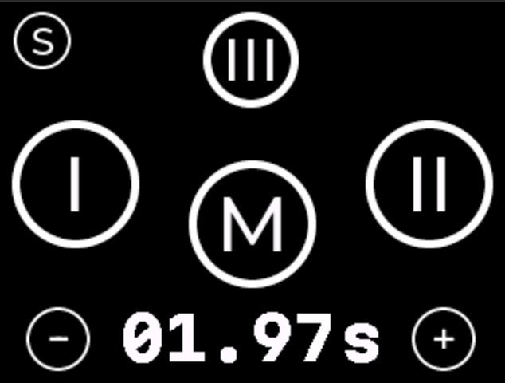
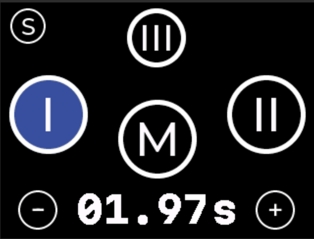
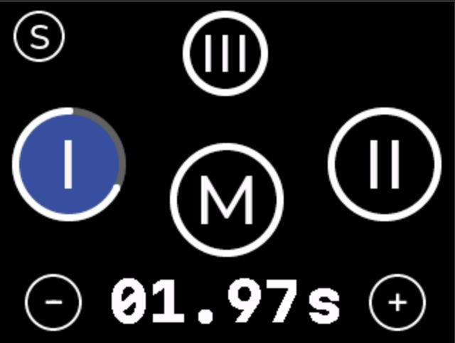
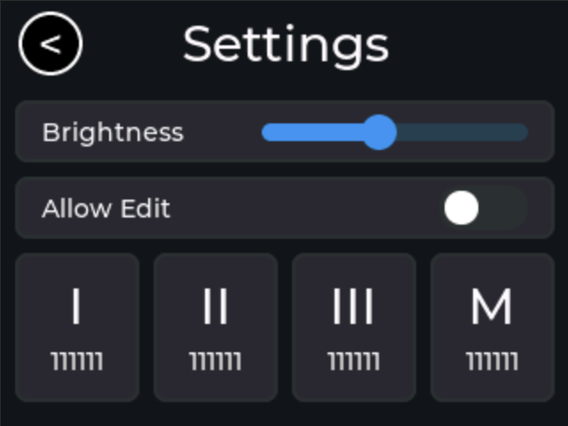

# ☕️ ESPGrind

*Experimental* **Espresso Mill Controller** 
(c) 2025 karl@pitrich.com 
License: MIT 

### Overview

This is a touchscreen controller for an espresso mill. It will runs on an ESP32.

I made this because I got a very good espresso grinder with a broken controller super cheap. As always, the spare parts are unobtainuim or prohibitively expensive. [#rightToRepairNow](https://repair.eu/)

**Beware:** This was developed on a car ride from Munich to Berlin, so it will be mostly buggy. I appreciate your kind fix or improvement as a PR.

As always, I had a [ESP32-BOX](https://github.com/espressif/esp-box) at hand, so this is what is runs on. It should be mostly trivial to run on other ESP32 boards with a touchscreen that works with [LVGL](https://docs.lvgl.io/master/intro/introduction.html).

I used (and liked!) [Squareline Studio](https://squareline.io/) to create the UI (320x240). Most of the UI is flex layout, so it should be easy to adapt to other resolutions.

My other coffee grinder is made by a well-known Italian company called "🚀". As I enjoy their UI on my "👊-o touch" (👊 in German, i.e. [faʊ̯st]) mill daily, so I ~~mostly stole it~~ was inspired by it. I improved it by adding some nice arcs around the buttons that indicate the remaining time and simplified the settings screen.

### Features
- 3 Programmable Timers (I, II, III)
- 1 Manual Button, creatively labeled ...  M
- Simple screen for settings and showing counters
- Controls one relay via GPIO (I recommend to use a solid state relay)
- Settings, state and counters are automatically persisted in ESP32 NVM a few seconds after a change

### Hardware implementation
Proposal:

- ESB-BOX, M5Stack, or similar ESP32 board with *capacitive* touchscreen (check for LVGL support) Avoid the "cheap yellow board" or any board with resistive touchscreen
- A "Mean Well" IRM 03 5V AC power supply module to power it
- Use a solid state relay (PCBs with 4 are very cheap on $AMZN or $EBAY) to control the mill motor.

### Demo
Click image to see a demo and me struggling with the LVGL switch widget

### Screenshots

Main Screen

Timer Selected

Timer Running

Settings Screen

